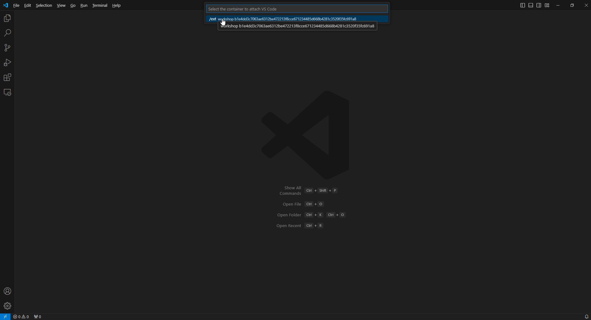

1. Install VS Code: https://code.visualstudio.com/download
1. Install Dev Containers extension:
    1. Click on Remote button at the left bottom corner of the screen
    1. Select Dev Container
    
1. Connect to the container EXT:
    1. Click on Remote button at the left bottom corner of the screen
    1. Click on Attach to Running Container
    
    1. VS Code will give you a warning. Click "Got It"
        
    1. Select the container EXT from the list:
        
1. VS Code will open a new window attached to the container EXT. Click "Open Folder" and select the folder with the extenstion code. It's located at `/home/runner/building_ext/source/char_count`
    
1. Install "C/C++ Extension". Either of the following options will work:
    1. VS Code should give you a tooltip at the bottom right corner of the screen. Click "Install"
    1. If you don't see the tooltip:
        1. Open Extensions tab on the left-hand side of the screen. It looks like four squares.
        1. Open "Recommended"
        1. Find C/C++ and click "Install"
    
1. Go to Explorer tab on the left-hand side of the screen. It looks like two sheets of paper on top of each other.
    1. Open `char_count_c.c`
    1. Set a breakpoint on line 15. To do this, click on the left side of the line number. A red dot should appear.
    
1. Connect to PostgreSQL from the built-in terminal
    1. In the top menu, click "Terminal" / "New Terminal"
    1. In the terminal, run `psql postgres`. It will connect to PostgreSQL server and make it spawn a backend process.
1. Attach the debugger to the PostgreSQL backend process
    1. Open the Run and Debug tab on the left-hand side of the screen. It looks like a triangle with a bug in its left bottom corner.
    1. At the top of the screen, click on the green play button with the text "(gdb) Attach".
    1. In the process selection field, type "idle". It will find the backend PostgreSQL process. There should be only one. Its full name should be `postgres: runner postgres [local] idle`
    1. Click on the process. It will attach the debugger to it
    
1. Run the function from the extension
    1. In the bottom tab, select "Terminal"
    1. In the list of the terminals at the bottom right corner of the screen, select the one running `psql`
    1. In the terminal, type `SELECT char_count_c('aaaabbbbbbbcc','a');` and press Enter
    1. It will invoke the function and the debugger will stop at the breakpoint.
    1. At the left-hand side of the screen, you will see the debug tab. You can explore the variables, call stack, set up watches and do other debugging stuff.
    
1. To continue the execution, use the Debug tab at the top of the screen. You can step into functions, step over them, continue the execution and detach the debugger altogether
1. Rebuild the extension after making code changes:
    1. In the application menu, select "Terminal" / "Run build task"
    1. It will rebuild the extension and install it to PostgreSQL extensions folder
    1. If you're running `psql` in the terminal, you will need to restart it to load the new version of the extension.
    
